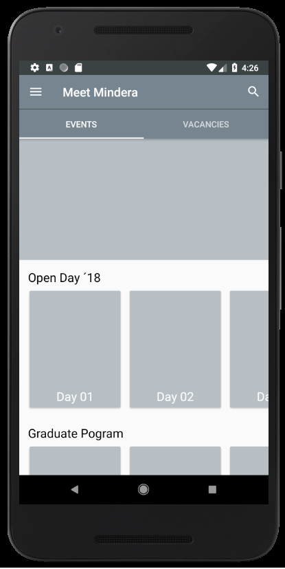
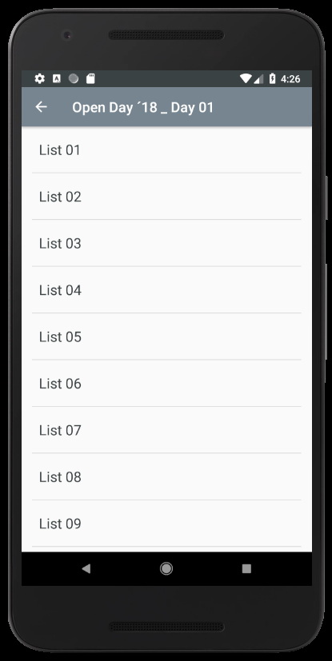
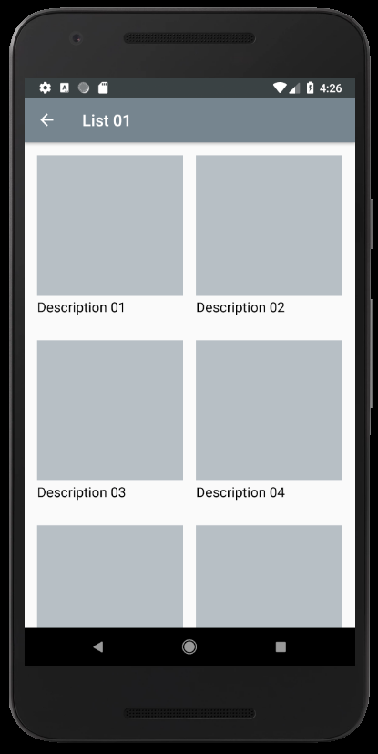

# Description
  - This repository was created in order to solve the Mindera Graduate Challenge (https://minderacraft.workable.com/jobs/490096).
  
	
	
	
  
# Challenge option
  - A) Implement a dummy user interface that follows the wireframe shown in this video https://tinyurl.com/mindera-graduates-app.
    The interface was built using Android (Java) in Android Studio 3.1.2 (tested from API level 19 to 27).

# Run the code
  - Open the project in android studio and Emulate an android device.
   <i>Or</i>
  - Copy the mindera_challenge.apk to your android phone and run it.

# What was left undone?
  - GOOD comments and code documentation
  - automated tests
